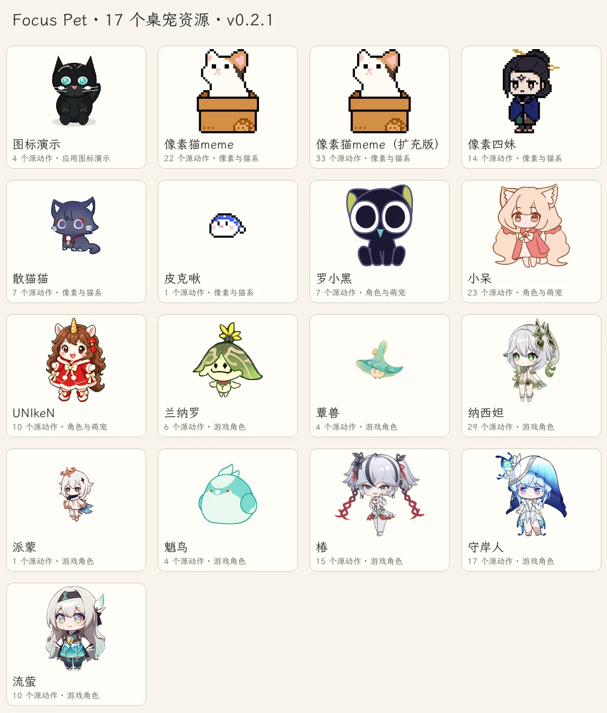
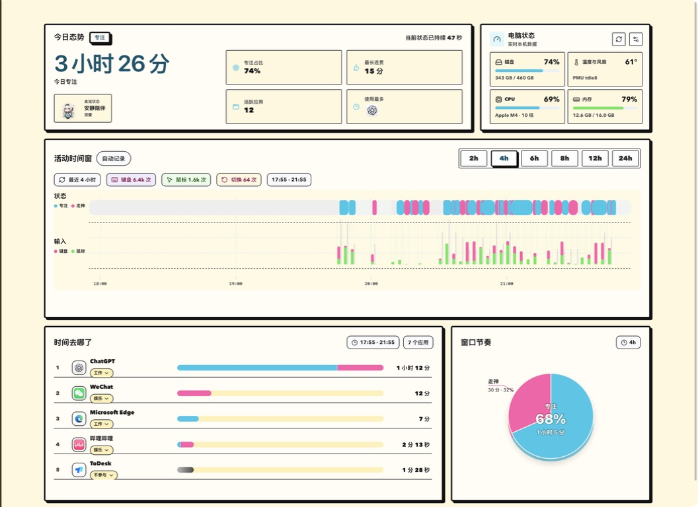

<div align="center">

# Focus Pet

**看见专注节奏，让桌宠陪你工作。**

本地优先的桌面专注助手：应用分类、键鼠节奏、历史统计，以及可自由导入的动画桌宠。

`Tauri 2` · `React 19` · `TypeScript` · `Rust`

[下载最新版本](https://github.com/VhahahaV/focus_pet_tauri/releases/latest) ·
[桌宠资源目录](docs/pet-packs/README.md) ·
[项目介绍](https://vhahahav.github.io/projects/focus-pet/) ·
[English](#english)

</div>

## 下载 v0.2.1

应用与桌宠资源分开下载，安装后可以只导入喜欢的角色。

| 平台 | 安装包 |
| --- | --- |
| macOS · Apple Silicon（M 系列） | [DMG](https://github.com/VhahahaV/focus_pet_tauri/releases/download/v0.2.1/Focus-Pet-0.2.1-macos-arm64.dmg) |
| macOS · Intel | [DMG](https://github.com/VhahahaV/focus_pet_tauri/releases/download/v0.2.1/Focus-Pet-0.2.1-macos-x64.dmg) |
| Windows · x64 | [安装程序 EXE](https://github.com/VhahahaV/focus_pet_tauri/releases/download/v0.2.1/Focus-Pet-0.2.1-windows-x64-setup.exe) |
| Linux · x64 | [AppImage](https://github.com/VhahahaV/focus_pet_tauri/releases/download/v0.2.1/Focus-Pet-0.2.1-linux-x64.AppImage) · [DEB](https://github.com/VhahahaV/focus_pet_tauri/releases/download/v0.2.1/Focus-Pet-0.2.1-linux-x64.deb) |

macOS 安装包使用 ad-hoc 签名、未经过 Apple 公证；Windows 安装包没有商业代码签名。系统可能显示开发者验证提示。请从本仓库 Release 下载，并核对同页的 SHA-256 校验文件。

## 17 个桌宠，一次下载或按需选择



| 资源合集 | 包含内容 | 下载 |
| --- | --- | --- |
| **全部桌宠** | 全部 17 个资源包 | [全集 ZIP · 约 171 MB](https://github.com/VhahahaV/focus_pet_tauri/releases/download/v0.2.1/FocusPet-Pets-All-0.2.1.zip) |
| 应用图标演示 | Focus Pet 图标衍生动画 | [分类 ZIP](https://github.com/VhahahaV/focus_pet_tauri/releases/download/v0.2.1/FocusPet-Pets-demo-0.2.1.zip) |
| 像素与猫系 | 像素猫、扩充版、像素四妹、散猫猫、皮克啾 | [分类 ZIP](https://github.com/VhahahaV/focus_pet_tauri/releases/download/v0.2.1/FocusPet-Pets-pixel-0.2.1.zip) |
| 角色与萌宠 | 罗小黑、小呆、UNIkeN | [分类 ZIP](https://github.com/VhahahaV/focus_pet_tauri/releases/download/v0.2.1/FocusPet-Pets-companions-0.2.1.zip) |
| 游戏角色 | 兰纳罗、蕈兽、纳西妲、派蒙、魈鸟、椿、守岸人、流萤 | [分类 ZIP](https://github.com/VhahahaV/focus_pet_tauri/releases/download/v0.2.1/FocusPet-Pets-game-characters-0.2.1.zip) |

[完整分类目录与单包下载 →](docs/pet-packs/README.md)

1. 安装并打开 Focus Pet。
2. 进入 **桌宠 → 导入**，选择下载的 ZIP，无需手动解压。
3. 选择桌宠，打开“显示桌宠”，按需要调整动作映射、位置、大小和音效。

派蒙、皮克啾属于只有待机动画的轻量包。其他包的动作数量、作者、文件大小和校验值均可在[资源目录](docs/pet-packs/catalog.json)查看。

资源保留原作者、原始 `license` 与 `distribution` 标记；其中第三方和授权未明确的素材仍标记 `localOnly` / `unknown`。软件仓库的许可不覆盖这些图片或音频；资源仅用于个人本地体验，二次分发或商用需要确认原作者许可。

## 这次更新

- 移除会话同步、远程连接与智能体卡片，使应用回到专注记录和桌宠陪伴。
- macOS 键盘按下计一次，过滤长按连发及修饰键松开；鼠标双击计两次，移动、拖动和滚动不混入点击数。
- 刷新诊断不会再消耗尚未入账的输入；权限不足时不估算键鼠次数。
- 工作应用中的安静阅读、思考不会仅因短暂无输入被判为走神；锁屏、睡眠和离开阈值仍生效。
- 修复重启后连续专注时长包含停机时间的问题。
- 历史采用无损合并和批量保存，保留原有时长与统计；没有按年龄或“重要性”自动删除明细。
- 新增 **手绘涂鸦**，替换构成主义；保留新粗野主义和中世纪现代。

## 使用体验



- **今日**：专注/走神/离开状态、活动时间线、输入节奏、应用排行与本机硬件状态。
- **历史**：回顾不同时间范围的活动趋势；可手动修正应用分类。
- **桌宠**：原生桌面窗口，支持拖动、固定位置、动作映射、随机待机和可选音效。
- **设置**：三套主题、提醒、桌面状态卡和识别诊断。

所有活动记录保存在本机，不需要账号或云端同步。状态判断来自前台应用、分类规则、空闲和系统状态，是活动线索，不代表对人的注意力做精确测量。Linux 的全局输入/窗口识别能力受桌面环境限制，特别是 Wayland；详见[平台边界](docs/platform-adapters.md)。

## 本地开发

需要 Node.js 24、Rust 稳定版，以及对应平台的 [Tauri 环境](https://v2.tauri.app/start/prerequisites/)。

```bash
git clone https://github.com/VhahahaV/focus_pet_tauri.git
cd focus_pet_tauri
npm ci
npm run tauri:dev
```

`npm run dev` 启动浏览器预览（使用演示数据）；`npm run tauri:build` 构建原生应用。

```bash
npm run lint
npm run build
npm test
npm run test:ui
cargo test --manifest-path src-tauri/Cargo.toml
npm run verify:tauri-contract
npm run verify:frontend-tokens
```

资源归档使用 `python3 scripts/package-pet-library.py`（需要 Pillow）。完整本地资源库不写入 Git 历史，发布到 Release；源文件目录、生成的目录及 SHA-256 清单相互校验。详见[发布说明](docs/releases/README.md)。

## English

Focus Pet is a local-first desktop focus companion built with Tauri, React and Rust. It combines application classification, input rhythm, local history and an animated desktop pet. Download the application and pet packs separately from [Releases](https://github.com/VhahahaV/focus_pet_tauri/releases/latest), then import a ZIP from the Pet tab.

Version 0.2.1 removes agent/session integrations, improves macOS input counting and focus-state behavior, adds the Hand-drawn / Doodle theme, and archives all 17 pet packs with individual downloads, category bundles and checksums. Third-party art retains its original author and distribution metadata; no additional redistribution license is implied.

## 文档

- [桌宠资源与单包下载](docs/pet-packs/README.md)
- [v0.2.1 更新说明](docs/releases/v0.2.1.md)
- [架构与实现](docs/IMPLEMENTATION-NOTES.md)
- [平台能力与限制](docs/platform-adapters.md)
- [目标机器验收](docs/target-machine-validation.md)
