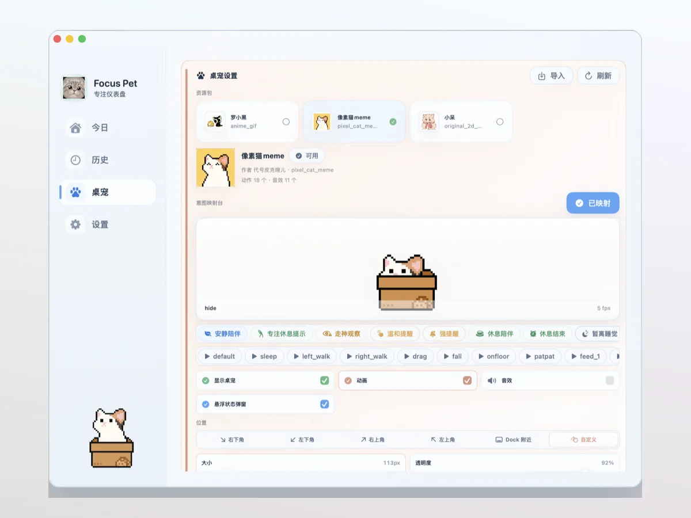
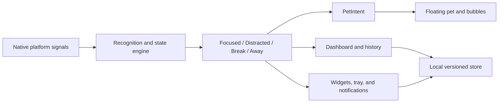

# Focus Pet

**A local-first cross-platform desktop focus companion with a responsive virtual pet.**

Focus Pet turns foreground-app context, input rhythm, idle time, and switching frequency into four understandable states: **focused**, **distracted**, **on break**, and **away**. A floating pet, lightweight reminders, desktop cards, and readable history all respond to the same local state engine.

[Project page](https://vhahahav.github.io/projects/focus-pet/) · [Previous Swift + SwiftUI implementation](https://github.com/VhahahaV/focus_pet) · [Platform validation](docs/target-machine-validation.md) · [Implementation notes](docs/IMPLEMENTATION-NOTES.md)



## What it does

- **Recognizes attention rhythm locally.** Focus Pet combines app context, idle time, input activity, and app-switching signals without requiring users to maintain task forms.
- **Keeps data on the device.** Timeline records, statistics, settings, and imported pet packs live in per-user application data outside the app bundle.
- **Separates state from expression.** The state engine produces semantic pet intents; each validated pet pack maps those intents to its own frames, audio, and actions.
- **Connects one state model to multiple surfaces.** The dashboard, history, tray/menu, notifications, status cards, and floating companion share the same runtime state.

## Product highlights

| Area | Evidence in the repository |
| --- | --- |
| Cross-platform desktop shell | Tauri 2, React, TypeScript, and Rust with dedicated macOS, Windows, and Linux adapters |
| Native activity sampling | Foreground app, idle/lock state, input counters, system metrics, and platform-specific fallbacks |
| Pet-pack system | Folder, manifest, single-archive, and collection-archive import with schema, frame, preview, license-metadata, and action-reference validation |
| Desktop integration | Tray/menu actions, system notifications, movable status-card windows, and a multi-display companion pet |
| Local data safety | Schema metadata, legacy migration, unsupported-version backup/write blocking, redacted export, and scoped data deletion |
| Verification | Vitest, Rust tests, Playwright desktop/mobile flows, native adapter probes, contract audits, and bundle checks |

## Architecture



The frontend and native backend meet through a stable Tauri command surface. Platform differences stay under `src-tauri/src/native/`; product logic remains testable in `src/core`, `src/app`, and `src/store`.

## Platform status

| Platform | Automated and observed evidence | Remaining sign-off |
| --- | --- | --- |
| macOS | Automated checks, native probes, universal app/DMG build, bundle audit, and launch smoke have been run | Developer ID signing, notarization, and final distribution policy |
| Windows | Direct adapter tests, release build, canonical data directory, pet-pack import, and NSIS install/uninstall/reinstall smoke were observed on Windows x86_64 | Complete tray/notification/long-running monitoring/pet-action smoke and elevated MSI install |
| Linux | Source adapter, helper preflight, and CI build/test path are maintained with an explicit Wayland-limited state | Real target-desktop validation and AppImage/deb/rpm launch smoke |

CI proves non-interactive build and test behavior. It does **not** replace visible desktop validation for permissions, notifications, tray interaction, widget windows, pet movement, or platform installers. See [Target Machine Validation](docs/target-machine-validation.md) and the [Windows handoff](docs/windows-compatibility-handoff-2026-07-18.md).

## Development

Requirements:

- Node.js 24
- Rust stable (minimum declared Rust version: 1.77.2)
- Tauri 2 platform dependencies for the current OS

```bash
npm ci
npm run tauri:dev
```

Core verification:

```bash
npm run build
npm test
npm run lint
npm run test:ui
cargo check --manifest-path src-tauri/Cargo.toml
cargo test --manifest-path src-tauri/Cargo.toml
```

Platform verification:

```bash
npm run verify:preflight
npm run verify:native
npm run verify:tauri-contract
npm run verify:migration
npm run verify:platform
```

`npm run verify:native:notify` displays a real system notification and should only be used in a visible desktop session.

## Repository map

- `src/core` — state model, classification, sessions, nudges, timelines, and summaries.
- `src/app` — runtime orchestration, persistence, user actions, native menu routing, widgets, and companion selection.
- `src/store` — browser/Tauri storage bridge and redacted export helpers.
- `src/resources` — pet-pack parsing, validation, source-action resolution, and preview records.
- `src/components` — dashboard, history, pet, settings, widgets, and companion UI.
- `src-tauri/src` — native commands, local JSON storage, import, notifications, windows, and platform adapters.
- `docs` — platform boundaries, migration evidence, validation checklists, and the preserved implementation narrative.

## Release and licensing status

- Version `0.1.1` macOS universal DMG artifacts have been built and smoke-tested in the original workspace, but no public GitHub Release is currently published.
- The repository is public source; a code license has not yet been selected.
- Third-party pet resources are importer fixtures or local validation material and are not automatically covered by a future code license. Their distribution terms must remain separate.

Do not redistribute third-party character assets unless their upstream license or author permission explicitly allows it.
