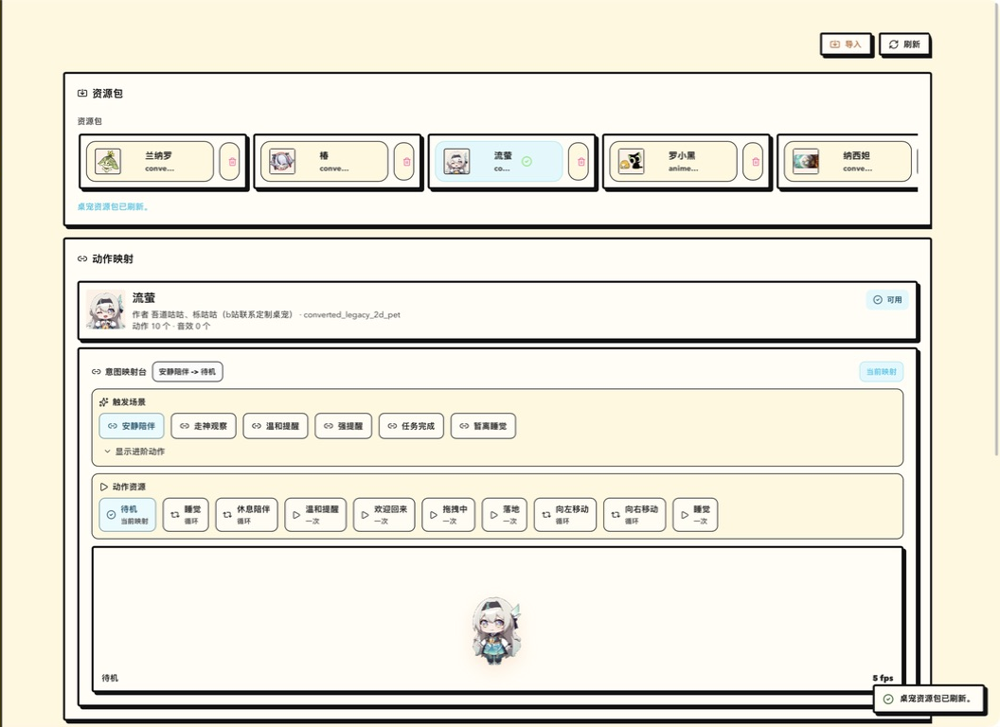

<div align="center">

# Focus Pet

**Your attention, made visible.**

A local-first desktop companion for understanding focus, recovering with intention,
and keeping a little character beside you while you work.

`Tauri 2` · `React 19` · `TypeScript` · `Rust` · `macOS / Windows / Linux`

[Project page](https://vhahahav.github.io/projects/focus-pet/) ·
[Implementation notes](docs/IMPLEMENTATION-NOTES.md) ·
[Platform validation](docs/target-machine-validation.md)

</div>


<p align="center"><sub>Live attention, input rhythm, app usage, and system health—in one view.</sub></p>

Focus Pet turns lightweight local signals—active apps, input rhythm, idle time, and
context switches—into a stable view of **focus**, **distraction**, **breaks**, and
**away time**. Raw activity history stays on your machine.

## What it does

- Explains where your time went with live timelines, daily summaries, and longer-term trends.
- Runs a resident native sampler without making the dashboard slower as history grows.
- Supports focus sessions, intentional breaks, reminders, widgets, and tray/menu actions.
- Lets built-in catalog rules and personal app classifications coexist predictably.
- Imports custom animated pet packs from folders, manifests, or ZIP archives.

## More than a dashboard



The companion is a real desktop window, not decoration inside the dashboard. It can react
to focus state, breaks, reminders, task completion, and away time. Choose a screen corner,
place it near the Dock or taskbar, or drag it somewhere custom.

Pet packs can define their own frames, audio, actions, and intent mappings. Focus Pet
validates the entire pack before copying it into local app data.

## Run locally

You need Node.js 24, Rust 1.77.2 or newer, and the
[Tauri prerequisites](https://v2.tauri.app/start/prerequisites/) for your platform.

```bash
git clone https://github.com/VhahahaV/focus_pet_tauri.git
cd focus_pet_tauri
npm ci
npm run tauri:dev
```

Use `npm run dev` for the browser-only interface and `npm run tauri:build` for a native bundle.

## Under the hood

The React interface talks to one stable Tauri command surface. Native adapters collect the
best activity signals each platform exposes, while the shared core handles classification,
state transitions, sessions, nudges, timelines, and summaries.

- [`src/core`](src/core) — attention model and product logic
- [`src/app`](src/app) — runtime orchestration and native event sync
- [`src/components`](src/components) — dashboard, history, widgets, and companion UI
- [`src/resources`](src/resources) — pet-pack parsing and validation
- [`src-tauri/src`](src-tauri/src) — persistence, native commands, windows, and OS adapters

User data lives in the per-user **Focus Pet** application-support directory. Schema-aware
migrations, backups, redacted export, and future-schema write protection keep that data safe.

## Verify

```bash
npm run lint
npm run build
npm test
npm run test:ui
cargo test --manifest-path src-tauri/Cargo.toml
npm run verify:tauri-contract
npm run verify:preflight
```

`verify:preflight` reports the native capabilities available on the current machine. See
[platform adapters](docs/platform-adapters.md) for implementation boundaries and the
[target-machine checklist](docs/target-machine-validation.md) for release validation.

## Documentation

- [Implementation notes](docs/IMPLEMENTATION-NOTES.md)
- [Codex session integration](docs/codex-session-integration.md)
- [Migration status](docs/migration-status-and-plan.md)
- [Brand specification](docs/brand-spec.md)
