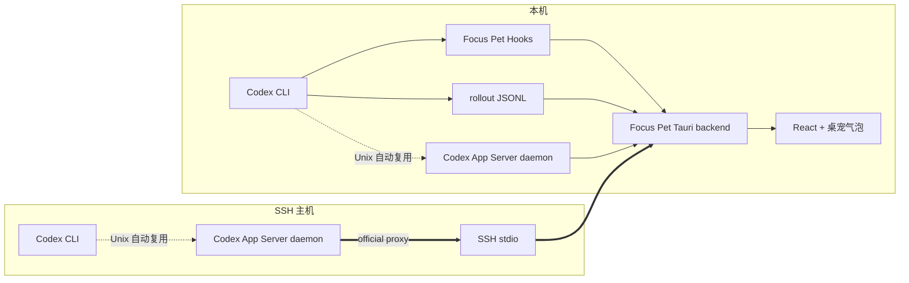

# 002 — Codex CLI 会话实时同步（本机与 SSH）

- **Status**: REBASELINE — official App Server first
- **Severity**: HIGH
- **Category**: Tauri backend, Codex integration, SSH, desktop pet UX
- **Research baseline**: 2026-07-28
- **Verified Codex CLI**: `0.145.0`
- **Estimated core scope**: 5–8 engineer-weeks
- **Optional cloud relay**: 另计 1–2 engineer-weeks

> **Architecture rebaseline (2026-07-28)**: 复核 Codex CLI 开源的 App Server、
> daemon/proxy 和 TUI 实现后，已确认官方的受管 daemon 是 SSH-driven 场景的
> 正式底座。此前实现的 SSH agent + JSONL replay 不能再作为主链路：它将被
> 官方 `codex app-server daemon bootstrap` + SSH stdio `codex app-server proxy`
> 替换；Hooks 只保留为不支持 managed daemon 的兼容降级。
>
> **Implementation snapshot (2026-07-28)**: 本机 Hook、assistant-only
> transcript tail、会话 reducer、原生事件桥接、桌宠气泡/会话列表、Hook
> 安装与卸载、内容隐私等级设置、脱敏协议 fixtures、长期 App Server
> observation stream、SSH Include/direct-host discovery、官方 daemon/proxy
> 两步接入、30 秒心跳和带抖动重连均已实现。`app-server proxy` 的传输已按
> 官方源码修正为 HTTP Upgrade + WebSocket 文本帧，不能误作 JSONL。自建
> remote agent、远端 journal、上传和 agent CI 已移除。实测 SSH 主机运行
> `codex-cli 0.145.0` / App Server `0.142.0`，且已有 App/IDE Remote Control
> 通道；其 `app-server proxy` 未转发第二个 WebSocket upgrade，但对同一 Unix
> Socket 的 SSH 内直连 WebSocket `initialize`、只读 `thread/list` 与
> `thread/turns/list(itemsView=summary)` 均成功（观察到 active、idle、notLoaded
> 与 final `agentMessage` 的结构）。因此实现以官方 proxy 为优先，
> 在其被动握手失败时安全回退为 SSH 内 Unix Socket 字节通道；不 bootstrap、
> 重启、上传或干预既有 session。
>
> **Prerequisite correction (2026-07-29)**: 本机 npm CLI 的 `codex app-server
> daemon start` 明确要求 `$CODEX_HOME/packages/standalone/current/codex`，但这
> 只限制 Codex 的持久 managed-daemon 模式。检测到普通 `codex` CLI 时，Focus
> Pet 在用户显式点击后启动官方 `codex app-server --listen unix://`，并且只在
> Focus Pet 正常退出时关闭自己启动的子进程；不在应用启动时后台反复尝试，也不
> 自动安装 standalone runtime。standalone 仍是可选的持久模式。

## 1. 结论先行

本功能采用官方 App Server 优先、Hooks 兼容降级的三层采集架构：

1. **受管 Codex App Server（正式主入口）**
   - 本机通过默认 Unix control socket；SSH 主机优先通过 `ssh -T <alias> --
     <codex-path> app-server proxy` 透传同一 WebSocket-framed JSON-RPC 流，
     若该 proxy 被动握手失败则回退 SSH 内 Unix Socket 字节通道。
   - 由官方 `thread/status/changed` 广播获取 `active`、
     `waitingOnApproval`、`waitingOnUserInput`、`idle`、`systemError`。
   - 只读 `thread/list` / `thread/turns/list` / `thread/items/list` 获取
     会话目录和最终 assistant 可见输出；绝不为监听调用 `thread/resume`。
2. **Codex lifecycle hooks（旧版/embedded daemon 降级）**
   - 只写入 Focus Pet 受管 handler；不读取或同步 prompt。
   - 当 managed daemon 未配置或不可用时，提供开始、完成和关闭信号。
3. **rollout JSONL（最后兼容层）**
   - 只在 Hook 给出路径时读取 assistant `output_text`；不作为新版本的
     SSH 主链路，也不把 JSONL 当作精确运行状态来源。

远程 SSH 主机由用户明确启用官方 managed daemon；Focus Pet 只通过用户已有
的 OpenSSH 通道把其 Unix control socket 的 stdio proxy（必要时纯字节直连）
隧道回来，不上传
Focus Pet agent、不维护远端 journal、不开放 App Server TCP 端口，也不抓取
ChatGPT 桌面应用的私有进程或私有协议。

### 必须接受的产品边界

- 可以可靠覆盖**完成接入配置之后启动**的本机 Codex CLI 会话。
- 可以通过已验证 WebSocket 握手的远端代理可靠覆盖已配置 SSH 主机上的
  Codex CLI 会话。
- App Server 能给出精确内存状态的前提是会话运行在 Focus Pet 连接的
  同一受管 daemon 中。
- 一个旁路启动的全新 App Server 无法获知另一个独立 Codex 进程的
  内存状态。本机实测：独立 CLI 会话仍在运行并持有 rollout 文件时，
  旁路 App Server 对所有线程均返回 `notLoaded`。
- 已经运行、且启动时尚未加载 Focus Pet Hook 的普通 CLI 无法被
  “追溯订阅”。这类会话只能用进程和 transcript 变化做推断。
- 截图中的蓝色地球是 ChatGPT/Codex 客户端的远端位置标识，不是公开
  的跨应用订阅 API。Focus Pet 会实现自己的 `host.kind = ssh` 标识，
  不抓取或复用 ChatGPT 私有 UI 数据。

## 2. 对“后端”的约定

本仓库只有 Tauri/React 桌面应用，没有独立云后端。因此本计划将
“我们的后端”定义为：

- `src-tauri`：本机采集、协议解析、状态归并、SSH 连接和隐私策略。
- React：只消费经过裁剪的会话快照与 UI 事件。

本机与 SSH 同步不依赖云服务。若后续需要多设备同步，使用可选
Phase 7 定义的 Cloud Relay，不阻塞本计划的核心交付。

## 3. 官方能力与实测结论

### 3.1 App Server 可提供什么

Codex App Server 是面向富客户端的 JSON-RPC 2.0 接口，支持：

- `thread/list`、`thread/read`、`thread/loaded/list`
- `thread/status/changed`
- `turn/started`、`turn/completed`
- `item/started`、`item/completed`
- `item/agentMessage/delta`

线程状态模型为：

```text
notLoaded
idle
systemError
active
  ├─ waitingOnApproval
  └─ waitingOnUserInput
```

但这些状态由当前 App Server 进程中的内存 `ThreadWatchManager` 维护。
不同 App Server 实例不会共享运行时状态，只共享持久化 thread
inventory 和 rollout。

### 3.2 为什么不能把 Focus Pet 注册成第二个完整会话客户端

App Server 支持多个连接订阅同一线程，但订阅者会收到服务端请求，
包括审批和用户输入请求。当前开源实现中还有要求“恰好一个订阅客户端”
的能力（例如 current-time provider）。

因此 Focus Pet 的观察连接必须遵守：

- 不调用 `thread/resume` 来订阅用户正在操作的线程。
- 不响应任何审批、输入或动态工具服务端请求。
- 只读取全局状态通知和只读查询。
- 完成内容优先走只读 `thread/turns/list`；只有 managed daemon 不可用时才
  回退到 Hook + rollout tail。
- 如果全局状态通知在某版本不可用，轮询 `thread/list`，而不是订阅。

这是避免 Focus Pet 干扰 Codex 原客户端的硬性安全边界。

### 3.3 Hooks 为什么仍需保留为兼容入口

Codex Hooks 当前提供稳定生命周期事件，并且每个 Hook 都收到：

- `session_id`
- `transcript_path`
- `cwd`
- `hook_event_name`
- `model`

其中：

- `UserPromptSubmit` 还包含 `turn_id` 和 `prompt`。
- `Stop` 还包含 `turn_id` 和 `last_assistant_message`。
- `SessionEnd` 在会话真正结束时触发。

Hook 需要用户审查和信任。Focus Pet 不允许使用
`--dangerously-bypass-hook-trust` 绕过这一流程。它们用于 embedded/旧版
CLI 的 lifecycle 和 assistant-final 降级，不能取代 official daemon 对
active/waiting 状态的精确观察。

### 3.4 本机现状验证

在 Codex CLI `0.145.0` 上已验证：

- thread inventory 存在于 `~/.codex/state_5.sqlite`。
- transcript 位于 `~/.codex/sessions/YYYY/MM/DD/*.jsonl`。
- rollout 中可见 `session_meta`、`event_msg`、`response_item`、
  `turn_context` 等记录。
- `notify` 只在每个 turn 完成后调用，payload 包含
  `agent-turn-complete` 和最后一条 assistant 消息；它不能覆盖开始、
  流式消息、等待审批和真正的 session 结束。
- 当前 CLI 有受管 daemon、默认 Unix control socket、stdio proxy
  以及 `--remote` TUI 能力。
- 当前 Unix TUI 会探测默认 daemon socket；没有 invocation-specific
  config override 时会自动使用 daemon。

### 3.5 能力等级

| 接入方式 | 生命周期 | 可见内容 | 精确等待状态 | 产品等级 |
| --- | --- | --- | --- | --- |
| 本机 Hook + transcript + 同一 managed daemon | 精确 | 支持 | 支持 | full |
| 本机 Hook + transcript，embedded CLI | 精确 | 支持 | 不支持 | degraded |
| SSH official proxy + 同一 remote daemon | 精确 | 支持 | 支持 | full |
| SSH 无 managed daemon | 无正常主链路 | 不支持 | 不支持 | unsupported（需用户先启用 daemon） |
| 仅旧 `notify` | 仅 turn 完成 | 仅最后回复 | 不支持 | legacy |
| 未配置的 ChatGPT 私有远端会话 | 不保证 | 不保证 | 不保证 | unsupported |

UI 和诊断页必须显示实际能力等级，不能把 inferred 状态呈现为 full。

## 4. 仓库现有基础与缺口

### 已有基础

- `src-tauri/src/agent_events.rs`
  - 已能通过 `--agent-notify` 接收 JSON/stdin。
  - 已能将完成事件写入本地 `agent-events.jsonl`。
- `src/app/useFocusPetApp.ts`
  - 每 1.5 秒 drain 完成事件。
  - 将完成事件转为 12 秒高优先级桌宠 intent。
  - 发送系统通知。
- `src/app/runtime.ts`
  - 已有 `transientPetIntent` 和 `latestPetBubble`。
- `src/components/PetCompanion.tsx`
  - 已有气泡渲染基础。
- `src/tests/core.test.ts`
  - 已有 agent completion 到桌宠 intent 的测试。

### 已实现与剩余验收

- [x] 统一的 session/turn/message 事件模型、Reducer、Tauri event bridge 与
  snapshot API。
- [x] 官方 App Server 长连接（本机）和 SSH stdio proxy（远端），带
  initialize/initialized、状态广播、定期只读 inventory、30 秒心跳和重连。
- [x] 只读 `thread/turns/list(itemsView=summary)` 的 final assistant 投影；不
  获取用户 prompt、reasoning、工具参数或终端输出。
- [x] Hook、rollout tail 和现有 completion notify 的兼容采集；内容等级与
  本地最小权限存储。
- [x] 桌宠气泡、会话面板、SSH 地球标识和设置页的接入/诊断/断开组件。
- [ ] 在安装官方 managed standalone runtime 的本机 Codex 环境完成真实
  managed-daemon active/waiting/idle 验收。
- [ ] 在已验证 SSH 主机完成桌宠端真实 active/idle/完成消息与断线重连验收。
- [ ] 完成 Windows 合并、跨平台打包和安装包验证。

## 5. 目标与非目标

### 核心目标

- 本机 Codex turn 开始后 500 ms 内显示“正在运行”。
- 用户可见 assistant 内容在写入 transcript 后 1.5 秒内进入桌宠气泡。
- turn 完成/失败/中断后 1 秒内更新状态并按设置发送通知。
- 等待审批/等待用户输入在受管 App Server 模式下 500 ms 内提示。
- 同时追踪至少 8 个活跃会话，不丢失最终状态。
- SSH 断线后自动重连；断线期间只标记 transport offline，重连后按官方
  App Server 当前状态恢复观察，不承诺不存在的自建 cursor replay。
- 远端会话明确显示主机名和地球图标。
- 默认不把对话内容发送到云端，不持久化完整对话。

### 本期非目标

- 不从 ChatGPT 桌面应用内部抓取私有状态。
- 不让 Focus Pet 代替用户批准 Codex 操作。
- 不从 Focus Pet 发送 prompt、steer 或 interrupt。
- 不展示 raw reasoning、完整工具参数、环境变量或未裁剪终端输出。
- 不保证任意旧版本 Codex 的 transcript 格式。
- 不在首版支持远程 Windows SSH Host 的精确 daemon 状态。
- 不复制或复用 ChatGPT Remote 的私有连接、设备凭据或安全 relay；若官方
  Remote Control 配对消费者 API 成熟，作为明确授权的后续接入项实现。

## 6. 目标架构



### 6.1 Tauri 内部模块

计划新增：

```text
src-tauri/src/codex/
  mod.rs
  types.rs
  manager.rs
  reducer.rs
  hook_ingest.rs
  event_journal.rs
  transcript_tail.rs
  transcript_parser.rs
  app_server/
    mod.rs
    codec.rs
    client.rs
    daemon.rs
    protocol.rs
  ssh/
    mod.rs
    config.rs
    connection.rs
    provisioning.rs
  privacy.rs
  diagnostics.rs

```

前端计划新增：

```text
src/app/codexSessionPayload.ts
src/core/codexSessions.ts
src/components/CodexConnectionSettings.tsx
src/components/CodexSessionBubble.tsx
src/components/CodexSessionsPanel.tsx
```

现有 `agent_events.rs` 在兼容期保留。新 manager 稳定后，原有 completion
event 转为统一事件源 `legacyNotify`，避免两个状态系统长期并存。

## 7. 统一协议与数据模型

### 7.1 Event envelope

```ts
type CodexEventKind =
  | "host.connected"
  | "host.disconnected"
  | "session.started"
  | "session.ended"
  | "turn.started"
  | "turn.statusChanged"
  | "message.updated"
  | "turn.completed";

interface CodexEventEnvelope {
  schemaVersion: 1;
  eventId: string;
  sequence: number;
  hostId: string;
  sessionId: string;
  threadId?: string;
  turnId?: string;
  occurredAt: string;
  receivedAt: string;
  kind: CodexEventKind;
  source: "hook" | "appServer" | "rollout" | "legacyNotify" | "processProbe";
  confidence: "exact" | "inferred";
  payload: Record<string, unknown>;
}
```

约束：

- `(hostId, eventId)` 幂等。
- `sequence` 在每个 host 内严格递增。
- SSH 重连按最后确认的 `sequence` 重放。
- reducer 不依赖到达顺序；使用事件时间、source priority 和 terminal
  state 规则解决乱序。

### 7.2 Host

```ts
interface CodexHost {
  id: string;
  kind: "local" | "ssh";
  displayName: string;
  sshAlias?: string;
  platform?: string;
  architecture?: string;
  codexVersion?: string;
  connectionStatus: "disabled" | "connecting" | "online" | "degraded" | "offline";
  lastHeartbeatAt?: string;
  capabilityMode: "managed" | "hooks" | "legacy";
}
```

### 7.3 Session、Turn 与 Message

状态必须分层，不能把“CLI 进程仍活着但 turn 已完成”误写成“进程结束”：

```ts
interface CodexSessionState {
  hostId: string;
  sessionId: string;
  threadId?: string;
  title?: string;
  cwd?: string;
  sourceKind?: string;
  lifecycle: "open" | "closed" | "unknown";
  runtime: "notLoaded" | "idle" | "active" | "systemError" | "unknown";
  activeFlags: Array<"waitingOnApproval" | "waitingOnUserInput">;
  currentTurn?: CodexTurnState;
  latestVisibleMessage?: CodexVisibleMessage;
  updatedAt: string;
}

interface CodexTurnState {
  turnId: string;
  status: "inProgress" | "completed" | "failed" | "interrupted" | "unknown";
  startedAt?: string;
  completedAt?: string;
  errorSummary?: string;
}

interface CodexVisibleMessage {
  itemId?: string;
  role: "user" | "assistant";
  phase?: "commentary" | "final_answer";
  text: string;
  isFinal: boolean;
  updatedAt: string;
}
```

### 7.4 Source priority

同一状态冲突时按以下优先级：

1. App Server typed status/turn event
2. Hook lifecycle event
3. rollout lifecycle event
4. legacy `notify`
5. process/file activity inference

Terminal turn state（failed/completed/interrupted）不得被更早的 running 事件
覆盖。SSH 断线只把 host 标记 offline，不得把全部 turn 误判为 completed。

## 8. 内容与隐私策略

设置提供三个等级：

1. `statusOnly`
   - 只显示运行、等待、完成、失败和项目/主机。
2. `assistantVisible`（默认）
   - 额外显示 assistant 的 commentary/final 文本。
   - 不采集 raw reasoning 和工具参数。
3. `conversation`
   - 用户明确选择后，额外显示用户 prompt。

默认保留策略：

- UI 进程内每个 session 只保留最近 20 条裁剪消息。
- 单条气泡文本最多 220 个 Unicode 字符。
- 完整内容不写入 Focus Pet 持久化 snapshot。
- 本地 journal 默认只保存状态和内容 hash；为断线重放保存的内容在消费后
  删除。
- 诊断日志只记录 event kind、hostId hash、sessionId hash、延迟和错误码。
- 不读取 `auth.json`、API key、access token 或 shell environment。

## 9. 桌宠与会话 UI 规则

### 9.1 气泡

- Header：Codex 图标、项目名、主机名。
- SSH 会话显示地球图标。
- Body：最近一条允许显示的 assistant 消息。
- Footer：
  - 运行中：活动指示器。
  - 等待审批：持续显示，直到状态解除。
  - 完成：显示 12 秒。
  - 失败：显示 20 秒并提供“打开会话列表”。
- 多会话并行：
  - 默认显示最近发生重要状态变化的会话。
  - Header 显示“另有 N 个任务运行中”。
  - 不按 token delta 高频切换会话。

### 9.2 更新节流

- 后端可高频接收，但 UI `message.updated` 最多 4 Hz。
- 每 100 ms 合并同一 `(sessionId, turnId, itemId)` 的增量。
- 空白、只有标点变化或短于 80 ms 的中间态不触发动画。
- 完成/失败/等待审批不受普通消息节流影响。

### 9.3 会话面板

首版增加简单会话面板，至少展示：

- 标题/preview
- 本机或 SSH 主机
- cwd 的最后两级
- session/turn 状态
- 最近更新时间
- 最近一条允许显示的消息

不提供 archive、delete、interrupt、approve 等写操作。

## 10. 分阶段开发计划

每阶段必须通过自己的验收门，才能开始下一阶段。不得同时铺开远程、
云 relay 和 UI。

### Phase 0 — 协议 Spike 与兼容矩阵（2–3 天）

任务：

- [x] 在独立实验目录生成当前 Codex App Server JSON Schema；能力记录见
  `docs/codex-integration/compatibility-matrix.md`。
- [x] 保存只包含协议结构、不含用户内容的测试 fixtures。
- [x] 在隔离 `CODEX_HOME` 验证本机 daemon start/proxy/stop 生命周期；真实用户
  standalone runtime 的验收仍保留在第 4 节。
- [ ] 验证普通 `codex` 在 daemon 存在时的自动复用条件。
- [ ] 验证带 `-c`、profile、strict config、hook trust override 时的行为。
- [ ] 配置四个 Hook，记录实际 payload 和触发顺序。
- [ ] 验证 `thread/status/changed` 是否能被未订阅观察连接接收。
- [ ] 如果不能，验证 2 秒一次 `thread/list` 的资源成本。
- [ ] 验证 rollout 在 commentary、final、tool call 和失败场景中的记录。
- [ ] 建立 Codex 版本能力探测，不以字符串猜测能力。

交付物：

- `docs/codex-integration/compatibility-matrix.md`
- 无敏感内容的 Hook/App Server/rollout fixtures
- App Server 与 Hook capability probe 规格

验收门：

- 不发真实 prompt 也能完成协议 codec 测试。
- 明确当前版本每个状态的唯一或降级来源。
- 证明观察连接不会订阅线程、不会接收或响应审批请求。

### Phase 1 — 本机生命周期 MVP（4–5 天）

任务：

- [ ] 新建统一 event types、journal 和 reducer。
- [ ] 扩展可执行入口：
  - `--codex-hook`
  - `--agent-notify` 保持兼容
- [ ] 支持 `SessionStart`、`UserPromptSubmit`、`Stop`、`SessionEnd`。
- [ ] Hook handler 必须快速 append 后退出，目标小于 50 ms。
- [ ] journal 使用权限 `0600`、append + fsync 策略、文件大小上限和轮转。
- [ ] Tauri 启动时运行 `CodexSessionManager`。
- [ ] 用 Tauri event 推送增量，用 command 提供全量 snapshot。
- [ ] 设置页增加：
  - 启用/停用
  - dry-run 配置预览
  - 安装/移除 Hook
  - Hook trust 状态说明
- [ ] Hook 安装器先检测用户层使用的是 `hooks.json` 还是
  `config.toml` 内联 `[hooks]`，沿用现有表示；两者都不存在时使用
  `~/.codex/hooks.json`。
- [ ] 不在同一 config layer 同时创建 `hooks.json` 和内联 `[hooks]`，
  避免 Codex 重复加载并告警。
- [ ] 合并 Hook 时不覆盖其他 handler。
- [ ] 修改前建立备份，写入使用临时文件 + atomic rename。
- [ ] 卸载只删除带 Focus Pet integration marker 的 handler。

验收门：

- 新开 CLI 后 500 ms 内显示 session open。
- 提交 prompt 后 500 ms 内显示 turn running。
- 正常 Stop 后 1 秒内显示 completed。
- CLI 正常关闭后 1 秒内显示 session closed。
- 用户原有 Hook 配置语义和顺序保持不变；所选配置文件除新增 Focus Pet
  节点外无变化，未选中的配置文件字节级不变。
- 未信任 Hook 时设置页明确显示 degraded，不伪报已接入。

### Phase 2 — 本机可见内容与桌宠气泡（4–6 天）

任务：

- [ ] 根据 `transcript_path` 建立增量 tail。
- [ ] 处理：
  - partial line
  - truncate
  - rename/rotation
  - app 重启后的 offset 恢复
  - UTF-8 跨 chunk
- [ ] 容错解析 `session_meta`、`event_msg`、`response_item`。
- [ ] 只输出 user/assistant 可见文本和 turn lifecycle。
- [ ] 未知 record type 计数但不报错退出。
- [ ] parser 失败时继续使用 Hook 的 prompt/last assistant message。
- [ ] 实现内容等级和内存 ring buffer。
- [ ] 实现 Codex 气泡、远端图标占位、多会话计数和状态优先级。
- [ ] 调整 `PetCompanion` window mode，使 Codex 状态气泡可显示。
- [ ] 保留现有手动气泡、专注提醒和物理互动优先级。
- [ ] 增加只读会话面板。

验收门：

- commentary/final 写入 transcript 后 1.5 秒内可见。
- 100 个 delta/record burst 不造成 100 次 React render。
- raw reasoning、tool arguments、environment 和 terminal output 不进入 UI。
- 同时运行 8 个会话，完成通知和最终消息均不丢失。
- app 重启后不会重复弹出已确认的旧完成通知。

### Phase 3 — 本机受管 App Server 增强（3–4 天）

任务：

- [ ] capability probe 检测 `app-server daemon`、`proxy` 和 schema。
- [x] 设置页提供“启用精确状态”并解释会启动本机 daemon。
- [x] 通过 `codex app-server daemon start` 启动，不自行复制内部 socket 规则。
- [x] 通过 `codex app-server proxy` 建立 HTTP Upgrade + WebSocket RPC 连接。
- [x] 完成 initialize/initialized handshake、request id、超时和重连。
- [ ] 使用稳定方法：
  - `thread/list`
  - `thread/loaded/list`
  - `thread/read(includeTurns=false)`
- [x] 使用 `thread/status/changed`；不可靠时用 2 秒轮询补偿。
- [x] 不调用 `thread/resume`，不订阅活跃线程。
- [x] 不发送 turn、approval、input 或 process 控制请求。
- [x] 把 active flags 归并到统一状态机。
- [x] Focus Pet 退出时默认不停止用户正在使用的 daemon。
- [ ] 只在 daemon 由 Focus Pet 启动且用户选择“随应用停止”时停止。

验收门：

- 普通 Unix `codex` 会话进入同一 daemon，并被识别为 active。
- waitingOnApproval、waitingOnUserInput、idle、systemError 映射正确。
- 带特殊 CLI override 而回退到 embedded 的会话仍能由 Hook 追踪。
- Focus Pet 连接/断开不影响 CLI 输入、审批、当前时间或 turn 完成。
- App Server 崩溃后 Hook 模式继续工作，UI 标记 degraded。

### Phase 4 — SSH 官方远端代理（6–10 天）

首版支持：

- 远端 Linux x86_64
- 远端 Linux arm64
- 可选 macOS arm64/x86_64

任务：

- [x] 从 `~/.ssh/config` 发现 concrete host alias。
- [x] 使用 `ssh -G <alias>` 让 OpenSSH 解析 Include、ProxyJump、
  IdentityFile 等配置；不自行实现完整 SSH config parser。
- [x] 添加主机前运行只读检查：
  - SSH 可达
  - OS/arch
  - `codex --version`
  - exact Codex executable path（含 nvm/asdf runtime）
  - official daemon status
- [x] 用户确认后只运行官方 `codex app-server daemon bootstrap`；绝不上传
  Focus Pet 二进制、Hook 或 journal。
- [x] 本机通过固定 argv 优先启动：
  `ssh -T <alias> '<codex-path> app-server proxy'`，完成 initialize/initialized
  握手并接收 `thread/status/changed` 广播；若该 proxy 不能转发 upgrade，则仅在
  同一 SSH 通道内回退到已存在 Unix Socket 的纯字节 relay。
- [x] 仅请求 `thread/list` 和 `thread/turns/list(itemsView=summary)`；不调用
  `thread/resume`，只投影最终 `agentMessage`。
- [x] 重连退避为 1、2、5、10、30 秒并带 jitter；30 秒无协议活动标记 transport
  offline，但不改写 turn 的完成状态。
- [x] App Server RPC 始终经 SSH stdio 转发，不监听公网 TCP。
- [x] 远端 host/session key 使用 `(hostId, sessionId)`，避免 UUID 冲突。
- [x] 断开只停止本机 SSH proxy，绝不停止/卸载远端 Codex daemon、认证或其他客户端。
- [x] 已运行 daemon 的标准 proxy 握手失败时先验证纯字节直连；只有两条只读通道
  都失败才拒绝 provisioning，且绝不 bootstrap、重启或旁路附着到其他客户端。

验收门：

- SSH 主机上的 assistant final、精确运行/等待/完成状态能回到本机桌宠。
- 状态与内容 p95 延迟小于 2 秒。
- 拔网 60 秒再恢复，状态流自动重连且无重复完成提示；断线期间不能声称事件可
  被 agent journal 补发。
- SSH host key 变化按 OpenSSH 默认策略失败，不自动接受新 key。
- 恶意 host alias、cwd 或 transcript path 不能注入本地/远端 shell。
- 不需要开放 4500 或其他 App Server 网络端口。

### Phase 5 — 失败、升级与兼容加固（3–5 天）

任务：

- [ ] 覆盖 Codex 不存在、版本过旧、schema 不兼容。
- [ ] 覆盖 daemon stale socket、proxy EOF、RPC overload。
- [ ] 覆盖 transcript 不可读、记录损坏和磁盘满。
- [ ] 覆盖 Hook 被用户删除、改动、禁用或未 trust。
- [ ] 覆盖远端 Codex 版本不支持 daemon/proxy/history API 的降级诊断。
- [ ] 实现 feature flags：
  - `codexHooks`
  - `codexTranscript`
  - `codexAppServer`
  - `codexSsh`
- [ ] 实现一键降级到 `statusOnly + legacyNotify`。
- [ ] 增加诊断导出；默认全部 redacted。
- [ ] 编写安装、升级、卸载和故障排查文档。

验收门：

- 任一增强层故障都不会影响 Focus Pet 活动追踪主循环。
- 任一解析错误都不会让后台 task panic。
- 升级 Codex 后 schema 变化会触发 degraded 和诊断，不静默误解析。
- 断开后不残留 Focus Pet 后台 agent、远端文件或敏感内容；用户已有 Codex
  daemon 与认证保持不变。

### Phase 6 — 发布与灰度（3–5 天）

任务：

- [ ] 内部 dogfood：本机 3 天。
- [ ] 内部 dogfood：至少两个 SSH 主机、两种架构、3 天。
- [ ] 5% opt-in 灰度。
- [ ] 25% opt-in 灰度。
- [ ] 100% 可见但默认关闭远端 provisioning。
- [ ] 收集只含聚合值的指标：
  - 连接成功率
  - 状态延迟
  - parser unknown record count
  - reconnect count
  - duplicate event count
- [ ] 准备 feature flag kill switch。

发布门：

- 本机 session 状态准确率 ≥ 99%。
- 远端在线状态准确率 ≥ 98%。
- 完成事件重复率 < 0.1%。
- 空闲 CPU 增量 < 1%。
- Focus Pet RSS 增量目标 < 40 MB。
- 没有 P0/P1 隐私、审批干扰或配置破坏问题。

## 11. 可选 Phase 7 — Cloud Relay

只有在确认需要跨设备或云端会话列表时执行。本阶段不属于核心范围。

### 服务端接口

- `POST /v1/codex/devices/enroll`
- `WS /v1/codex/events`
- `GET /v1/codex/sessions?deviceId=...`

要求：

- 设备 token 存系统 Keychain/Credential Manager。
- Event envelope 原样使用 schema v1。
- 服务端按 `(deviceId, hostId, eventId)` 幂等。
- 默认只上传 `statusOnly`。
- 上传对话内容必须独立 opt-in，并支持立即删除。
- 服务端永不接收 Codex auth token 或 SSH private key。
- TTL 默认 24 小时；长期保留需要单独产品决策。

本阶段开始前必须提供独立 backend repo、认证体系、数据驻留和隐私要求。

## 12. 测试计划

### Rust unit tests

- JSONL codec：
  - 分片
  - 多消息同 chunk
  - 非法 JSON
  - 超大行
- reducer：
  - 乱序
  - 重复
  - terminal state
  - host disconnect
- transcript tail：
  - partial UTF-8
  - truncate
  - rotation
  - offset resume
- privacy：
  - reasoning/tool/env 不泄漏
  - 文本裁剪
- SSH：
  - 参数编码
  - host alias 校验
  - daemon/proxy 命令编码与 nvm runtime 路径

### TypeScript unit tests

- session selector 和多会话优先级。
- status 到气泡文案/颜色/图标。
- 4 Hz UI 节流和 delta 合并。
- runtime intent 与现有 nudge/interaction 的优先级。
- `statusOnly`、`assistantVisible`、`conversation` 三种模式。

### Integration tests

- fake Hook payload → journal → manager → Tauri snapshot。
- fake App Server over stdio → status reducer。
- `thread/list` 初始同步 + status notification + reconnect。
- fake SSH executable → heartbeat/reconnect/offline。
- Hook 安装/卸载 round-trip，保留第三方配置。

### E2E/manual matrix

| 场景 | macOS local | Linux local | Windows local | SSH Linux |
| --- | --- | --- | --- | --- |
| Hooks lifecycle | required | required | required | required |
| Transcript content | required | required | required | required |
| Managed daemon exact state | required | required | deferred/manual launcher | required |
| Waiting approval | required | required | degraded allowed | required |
| Network reconnect | n/a | n/a | n/a | required |
| Uninstall cleanup | required | required | required | required |

## 13. 安全审查清单

- [x] App Server 只使用 Unix socket、stdio proxy、SSH stdio 或 loopback。
- [x] 禁止未经 TLS/auth 的非 loopback WebSocket。
- [x] Focus Pet 不响应 server-initiated approval/input/tool requests。
- [x] 不调用 `thread/resume` 观察他人的活跃线程。
- [x] 不修改 `auth.json`。
- [ ] Hook 安装前展示 diff 并获得用户确认。
- [x] Hook command 使用固定 binary 和 integration marker。
- [x] SSH 调用使用 argv，不拼接用户输入 shell command。
- [x] 远端 provisioning 展示目标 host、官方 Codex 路径、daemon 操作和断开方式。
- [x] 本地 journal、设置文件权限最小化；远端不创建 Focus Pet journal/cursor。
- [ ] 诊断包默认 redacted。
- [x] 内容上传默认关闭。

## 14. 风险与应对

| 风险 | 影响 | 应对 |
| --- | --- | --- |
| App Server 仍是 experimental | 升级后协议变化 | capability probe、schema fixtures、feature flag、Hook 降级 |
| transcript 格式不稳定 | 内容解析失败 | 宽松 parser、未知类型忽略、Hook final fallback |
| 多客户端订阅干扰 Codex | 审批或工具行为异常 | 观察连接绝不 `thread/resume` 或订阅 |
| Hook 未 trust | 会话完全不进入主通道 | onboarding 检测、明确 degraded、保留 notify |
| CLI 带特殊 overrides 不复用 daemon | 精确状态缺失 | Hook/rollout 仍覆盖；UI 标注 inferred |
| SSH 断线 | 远端状态不确定 | host offline 与 turn completed 分离、自动重新建立官方 proxy |
| 多个 CODEX_HOME | 会话遗漏 | 首版支持默认 home；后续增加显式 profile |
| 超大 rollout | CPU/IO 过高 | tail offset、禁止反复 full read、bounded buffers |
| 配置合并破坏用户文件 | Codex 启动异常 | parse + dry-run + backup + atomic write + round-trip test |
| ChatGPT 私有远端会话不可见 | 与截图预期不一致 | 明确只保证 Focus Pet 已配置 SSH host；不承诺私有 API |

## 15. 执行纪律

后续严格按以下规则实施：

1. 每个 Phase 使用独立 PR/commit 范围。
2. 前一 Phase 验收门未通过，不开始下一 Phase。
3. 所有协议行为先有 fixture/test，再进入 reducer 或 UI。
4. 不在同一 PR 同时修改 Hook 安装、App Server 和 SSH。
5. 不把 App Server experimental 方法作为无降级的核心依赖。
6. 不在未完成安全测试前启用远端自动 provisioning。
7. 不用“最后文件更新时间”单独判断 turn completed。
8. SSH 断线不等于任务完成。
9. idle 不等于 session ended。
10. UI 永远消费统一模型，不直接解析 Hook/App Server/raw JSONL。

## 16. 建议的提交顺序

1. `codex: add event schema and reducer`
2. `codex: ingest lifecycle hooks`
3. `codex: add safe hook configuration manager`
4. `codex: tail and parse visible transcript events`
5. `ui: render codex session bubble and list`
6. `codex: add read-only app-server status observer`
7. `codex: add ssh host discovery and diagnostics`
8. `codex: add remote official App Server proxy observer`
9. `codex: harden compatibility and uninstall`
10. `docs: publish codex session integration guide`

## 17. 完成定义

核心功能只有在以下条件全部满足时才算完成：

- 本机 Hook、内容、完成、失败、关闭全链路通过。
- 受管 daemon 的 active/waiting/idle/systemError 通过。
- 普通 embedded CLI 能降级工作。
- 至少一台受支持 SSH 主机通过官方 proxy、断线重连和 assistant-final 同步测试。
- 多会话 UI 不漏完成事件、不泄漏被禁止内容。
- Hook 和远端官方 proxy 都可无残留断开；不修改远端 Codex 安装或认证。
- 全部自动化测试、平台验证和隐私审查通过。
- 文档明确说明 full、degraded、unsupported 三种能力等级。

## 18. 参考资料

- [Codex App Server](https://learn.chatgpt.com/docs/app-server)
- [Codex Hooks](https://learn.chatgpt.com/docs/hooks)
- [Remote connections and SSH hosts](https://learn.chatgpt.com/docs/remote-connections)
- [Codex CLI command reference](https://learn.chatgpt.com/docs/developer-commands?surface=cli)
- [OpenAI Codex open-source repository](https://github.com/openai/codex)
- [App Server implementation](https://github.com/openai/codex/tree/main/codex-rs/app-server)
